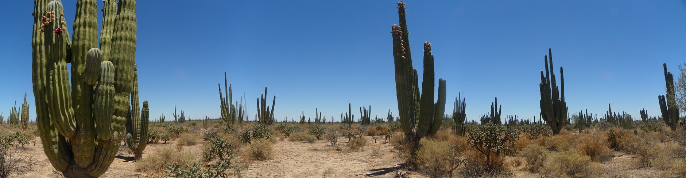
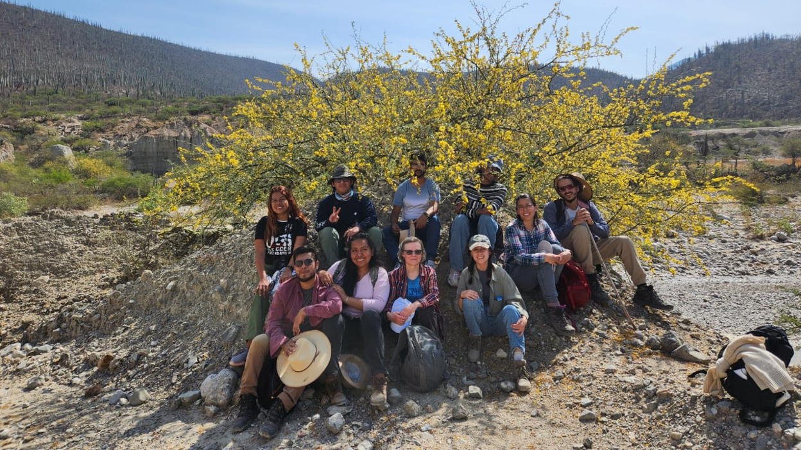

| [RESEARCH](./research.html)       | [LAB MEMBERS](./members.html)          |  [OUTREACH](./other.html) |  [NEWS](./news.html) |

* * *

Our lab is focused on the generation of genomic resources for Cactaceae and xeric shrubland species. We are also on the look for new model organisms to facilitate the study of these species from a molecular and physiological standpoint. In addition, we aim to develop and standardize <i>in-vitro</i> cultivation, micropropagation, and developing experimental approaches to learn from these amazing species, which have naturally evolved resilience to abiotic stress, including water deficit and high temperatures.

Here is a pic from dear colleagues (students, friends, and mentors) from whom I've learned and grown fond of cacti and other resilient species:

