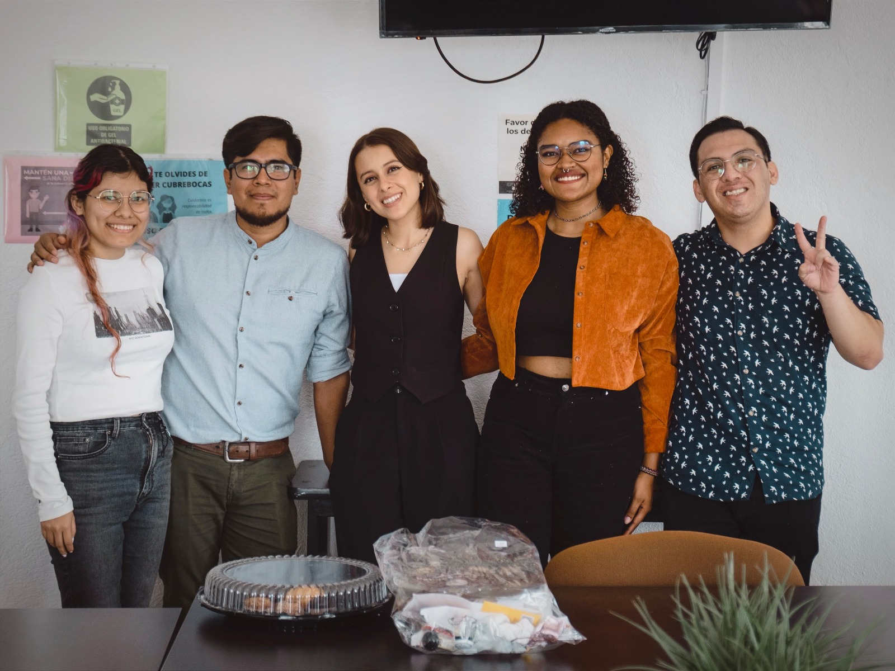
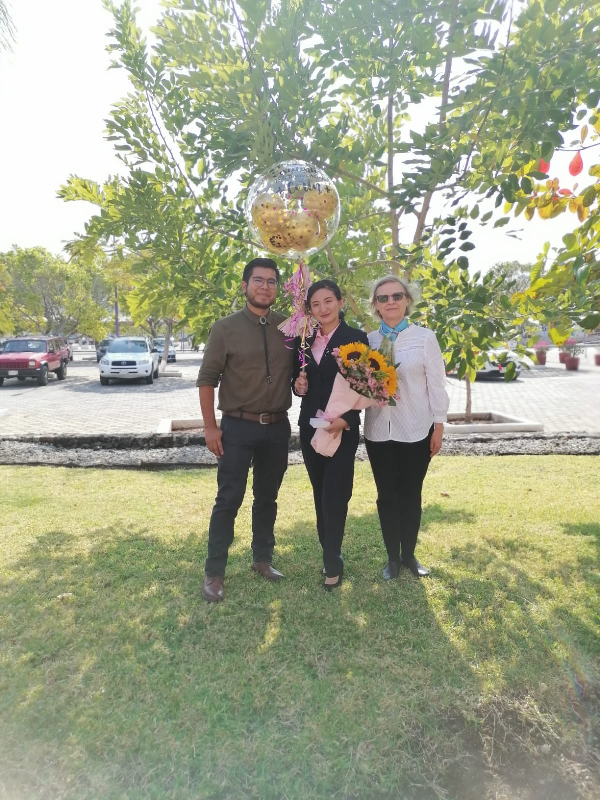

| [**HOME**](./index.html)| [**RESEARCH**](./research.html)       | [**PEOPLE**](./members.html)          |  [**OUTREACH**](./outreach.html) |  [**NEWS**](./news.html) |

* * *

<h1> Latest News </h1>

<h4><em> * Oct 16, 2024 </em> - A new graduate!</h4>
  Kenia Galván finished her bachelors in Genomic Sciences. She explored several -omics data to explore the genetic regulation of determinate growth in Cactaceae roots. The project faced some setbacks but she finally made it and she's now a Master student! Congrats, Kenia :)

<h4><em> * Nov 29, 2023 </em> - We've got a new graduate!</h4>
  Julieta Olvera finished her bachelors in Biochemistry and Molecular Biology. Her thesis was focused on developing and standardizing a High-molecular weight DNA extraction protocol from our favorite plants: Cactaceae! (and also other recalcitrant species). This was a very exciting road, full of challenges but also rewards, and it finally lead to a great end. Congrats, Juls!
  
  
 
 

<h4><em> * Aug 14, 2023 </em> - We are moving!</h4>
  The lab is starting fresh and new at the Autonomous University of Morelos. We will be part of the [CIDC](http://www.cidc.uaem.mx), where we hope to consolidate fruitful collaborations and start a new research journey!
 
 
<h4><em> * Dec 21, 2022 </em> - Corin got her bachelors!</h4>
  Corín Pacheco, who was a Biotech Engineer student at the [UPEMOR](https://www.upemor.edu.mx), received her Bachelor's degree. Her research project was focused on characterizing <i>Echinopsis mirabilis</i> as a putative model organism for Cactaceae species. Congrats Corin!
  
  

