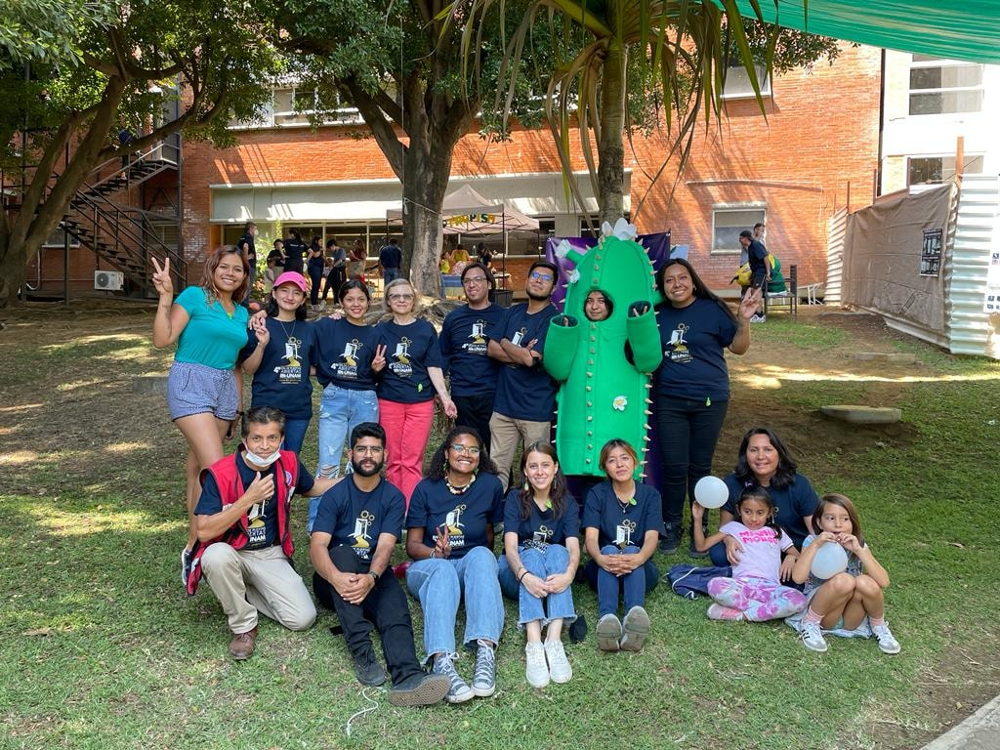
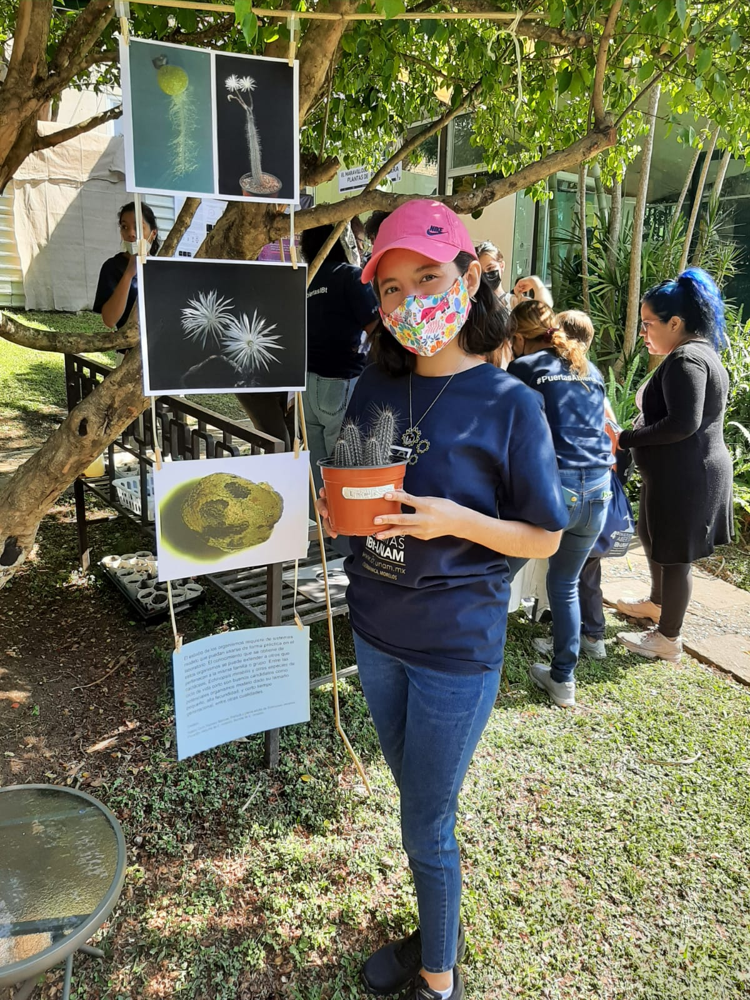
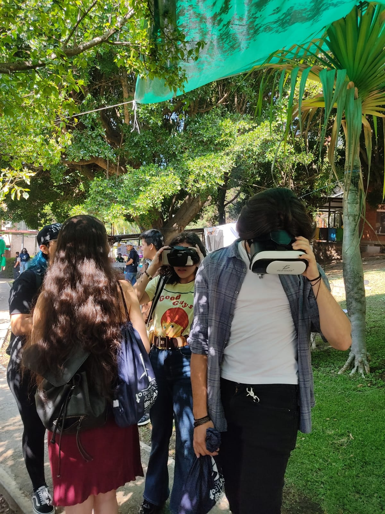
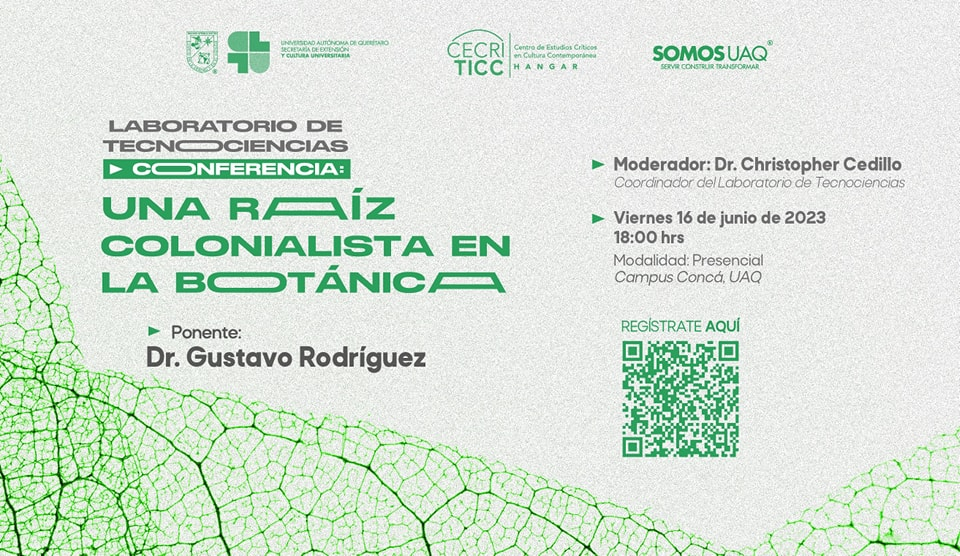
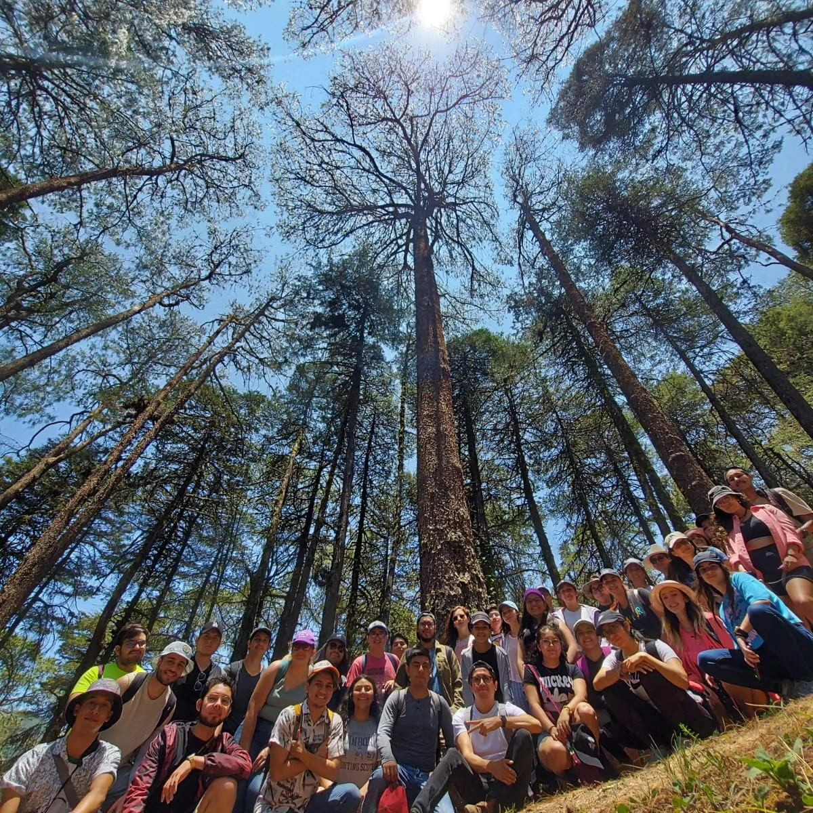
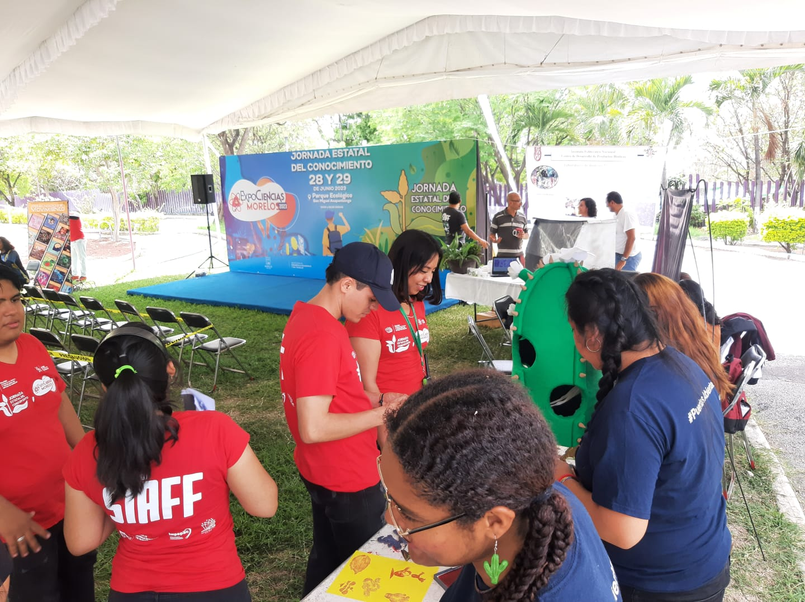

In our lab we understand that sharing our results is as important as generating them. We, therefore, encourage lab members to engage in science outreach and science communication strategies aimed at different audiences, but mainly to the general public, which through their taxes finance most of our research. Here are some of the latest activities in which we have participated: 

### Open Doors @ IBt - UNAM

*Disclaimer: Most of these activities were performed when I was at IBt-UNAM working with Dr. Svetlana Shishkova*

> Every two years at IBT-UNAM the doors are open for everyone to come see what we do in the lab.
> Here, some of my students made Cactus stamps, a photo gallery, live specimens showcase, and we
> even used augmented reality to take our visitors to the jungle in search of epiphytic cacti.

### Invited Speaker

> I was invited to the Autonomous University of Querétaro. We had a field trip to the campus Concá
> We visited part of the Sierra Gorda, saw how the UAQ is working on sustainability, and had an interesting
> discussion about how colonialism shaped botany, and how botany shaped empires.

# Science Fair

> Our group was invited to present some activities for students, from kindergarten to high schoolers.

