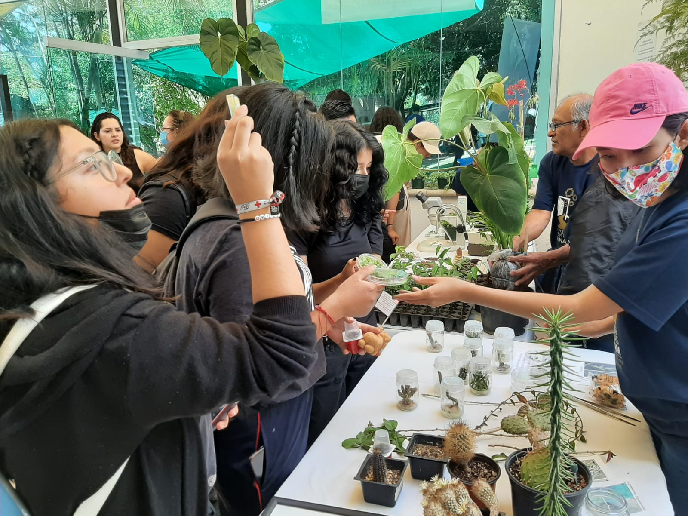

| [**HOME**](./index.html)| [**RESEARCH**](./research.html)       | [**PEOPLE**](./members.html)          |  [**OUTREACH**](./outreach.html) |  [**NEWS**](./news.html) |

* * *

# Outreach & SciComm

At our lab, we understand that sharing our results is as important as generating them. We actively promote science outreach and communication efforts among our members, targeting diverse audiences, with a primary focus on the general public, whose taxes significantly fund our research. Below are some of our recent participation activities: 

### Organizing [#SMBPlant2023](https://smbplant.quimica.unam.mx)
> We are getting ready for #SMBPlants2023, the largest biochemistry and molecular plant biology meeting in México!
> This year, #SMBPlant2023 will take place in Oaxaca. More info? Get in touch via [Twitter](https://twitter.com/SMBPlant2023), [Mail](mailto:congresoplantas.smb@gmail.com), or visit our [Website](https://smbplant.quimica.unam.mx).
 

### Open Doors @ IBt - UNAM

*Disclaimer: Most of these activities were performed when I was at IBt-UNAM working with Dr. Svetlana Shishkova*

> Every two years at IBT-UNAM the doors are open for everyone to come see what we do in the lab.
> Here, some of my students made Cactus stamps, a photo gallery, live specimens showcase, and we
> even used augmented reality to take our visitors to the jungle in search of epiphytic cacti.

### Invited Speaker

> I was invited to the Autonomous University of Querétaro. We had a field trip to the campus Concá,
> visited part of the Sierra Gorda, and saw how the UAQ is working on sustainability. I had an interesting
> discussion with the students about how colonialism shaped botany, and how botany shaped empires.

# Science Fair

> Our group was invited to present some activities for students, from kindergarten to highschoolers.

